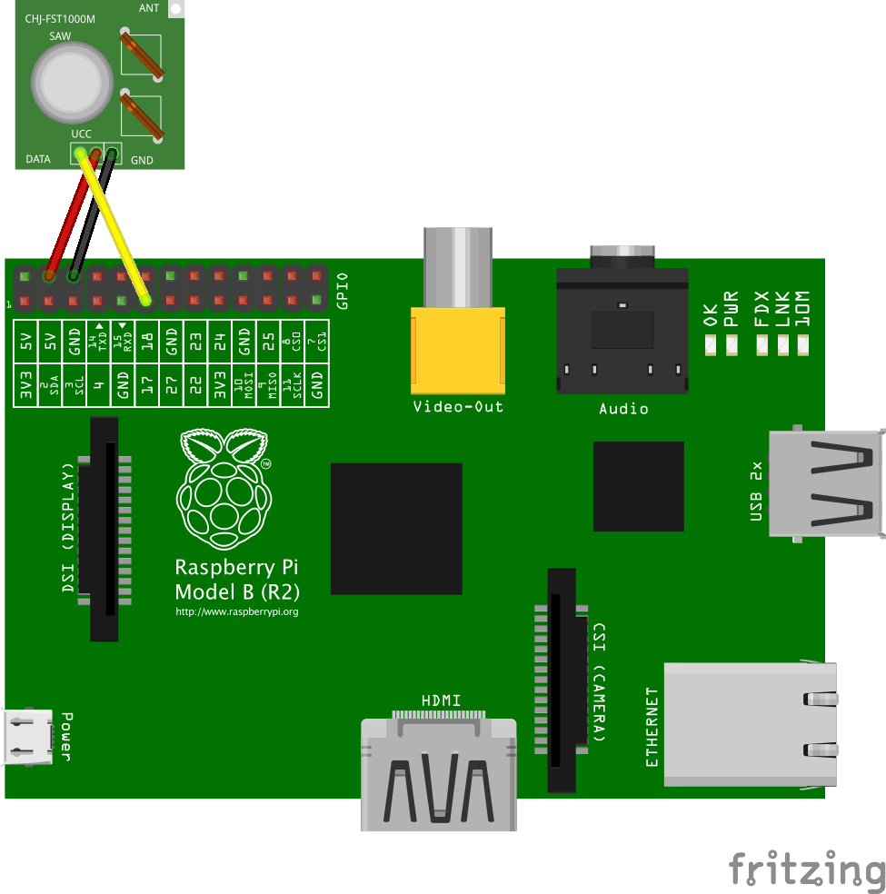

## Remote control Nexa switches from Raspberry Pi

Example for communicating with Nexa (or Arctech, KaKu, etc) 433MHz RF remote controlled power supply with a Raspberry Pi. This is a port from [erix Arduino lib](https://github.com/erix/NexaTransmitter) to RPi using [wiringPi](http://wiringpi.com)

# Requirements
* [wiringPi](http://wiringpi.com/download-and-install/)

* 433MHz transmitter circuit, for example [this](http://www.kjell.com/sortiment/el/elektronik/fjarrstyrning/433-mhz-sandar-och-mottagarmodul-p88905)

# Hardware setup
The transmitter is connected as follows:



# Quickstart
An example, NexaExample.cpp, will turn off a unit, wait 3 seconds and turn it back on again.

```$ git clone https://github.com/henrikjonhed/NexaTransmitter.git```

```$ cd NexaTransmitter```

```$ make```

```$ sudo ./NexaExample```
